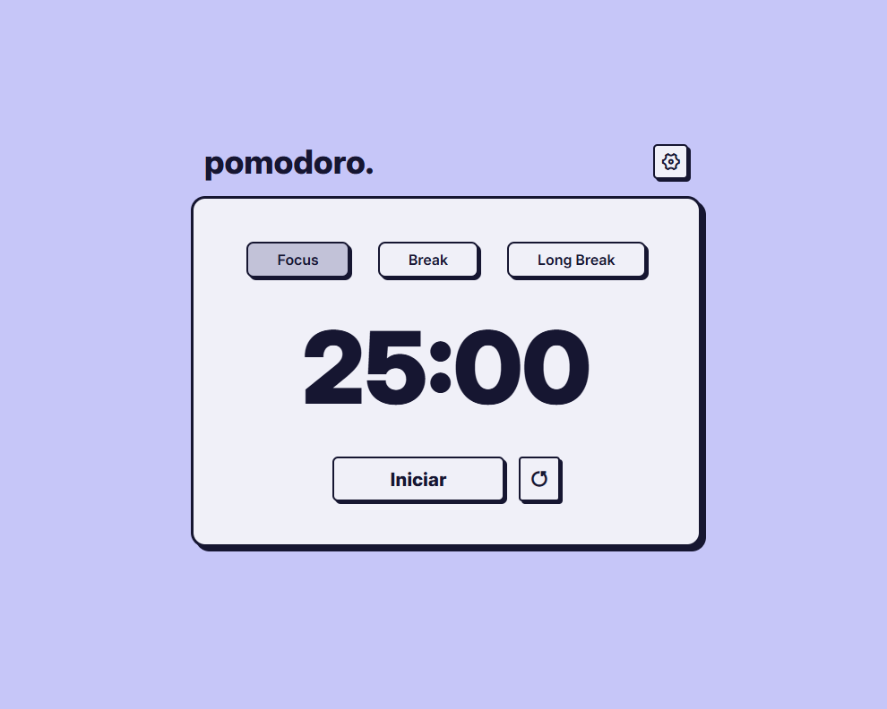

# ⏳ Pomodoro Timer

Eu criei meu próprio app de **Pomodoro** porque é uma técnica que uso bastante no dia a dia para organizar meus estudos e manter o foco.  
O aplicativo permite controlar ciclos de **foco**, **pausa curta** e **pausa longa**, com direito a sons, troca de temas e salvamento automático das configurações no navegador.

---

## 📌 Funcionalidades

- 🎯 **Timer Pomodoro** com contagem regressiva.  
- ⏸ **Iniciar / Pausar / Resetar** o tempo.  
- ⚙️ **Configurações personalizadas**:  
  - Defina a duração do Pomodoro.  
  - Ajuste tempo de pausas curtas e longas.  
- 🎶 **Feedback sonoro**:  
  - Som de clique nos botões.  
  - Som de alarme ao término do tempo.  
- 🎨 **Temas dinâmicos**: cada modo altera as cores da interface.  
- 💾 **Persistência local**: configurações salvas no `localStorage`.

---

## 🚀 Demo

🔗 [Clique aqui para ver o projeto online](https://pomodoro-app-pink-psi.vercel.app/)

---

## 🖼️ Preview

---

## 🔧 Tecnologias usadas

- **HTML5**
- **CSS3**
- **JavaScript**
- `localStorage` (para salvar configurações)
- Sons em **.mp3**

---

## 📚 Aprendizados

Durante o desenvolvimento deste projeto, pratiquei e aprendi:

- Manipulação do **DOM** com JavaScript.  
- Uso de **event listeners** para interações do usuário.  
- Controle de tempo com `setInterval`, `clearInterval`, `pause` e `reset`.  
- Estruturação de **componentes visuais dinâmicos** (botões, modal de configurações, troca de cores).  
- Persistência de dados no navegador usando **localStorage**.  
- Organização de código em funções reutilizáveis.  
- Integração de **efeitos sonoros** em ações da interface.  

Esse projeto foi uma ótima prática de lógica de programação e manipulação de interface no front-end.  

---

## 📅 Melhorias futuras (roadmap)

- ⏱️ Barra de progresso animada.  
- 📊 Histórico de ciclos concluídos.  
- 🎵 Opção de escolher sons diferentes.    

---

## 📝 Licença

Este projeto é de uso **pessoal e educacional**.  
Sinta-se à vontade para usar e modificar.